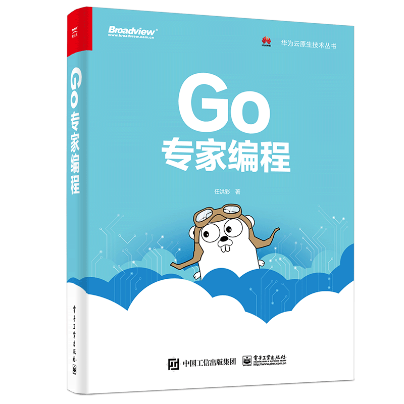

# 《GO专家编程》

## 图书介绍
本书涵盖内容：
- 常见数据结构、控制结构的实现原理剖析；
- 常用标准库实现原理剖析；
- 工具链使用、原理剖析（如 Go test、Go Module等）；
- 编程陷阱及相关真实案例解析；

## 纸质版
- 当当网链接：http://product.dangdang.com/28986429.html
- 京东商城链接：https://item.jd.com/12920392.html

## 致谢
本书写作过程中，得到了广大读者的支持和鼓励，作者本人也很高兴本书能够帮助到读者。

#### 读者鼓励：
- @Wang-Kai：
> 这一定是我在 Github 发现的最有价值的仓库之一。

- @liyonglion: 
> 感谢贡献如此好文，结合你的文章，再看源码如虎添翼。

- @li-keli:
> 首先，确实如你所说 是让初级进阶的文档
  下午github摸鱼看到这个库，草草阅读后，发现挖掘到了宝藏。
  忍不住收藏细细的再多读几遍。
  我读过基本Go的书，比如《Go实战》《Go并发编程》，对比之下，此文档也是干货满满，从目录看，直击我这种3年以内经验人的痛点，只会用，只会写项目，但是不理解底层，不理解实现，写不出高性能项目，可能遇到问题都不知道如何快速排查。
  其实我目前这种层次的人不是不知道问题所在，只是手头的资料并没有系统化，都很碎。
  市面上的go中文书籍或者文档都比较基础，官方文档一方面是英文，有些阅读障碍，另一方面，有部分确实比较难懂。

#### 热心读者
部分热心读者提交了大最PR帮助作者修复书中错误，在此向这些读者表示感谢：
- @marjune163
- @twz915
- @xiaoxuanzi
- @weiyuanke
- @wangdayong228
- @notech
- @li-keli
- @hjlarry
- @exqlnet
- Bingao-hn

特别感谢@marjune163帮忙修复了大量错误，本书出版后，特向@marjune163寄送了一本纸质书，聊表谢意。

## 后续
鉴于本仓库内容与纸质图书已有相当大的差异，也考虑到出版社的利益，暂时下架部分章节，待与出版社沟通后再陆续放出。
