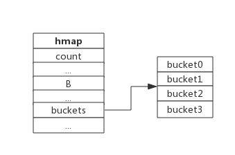
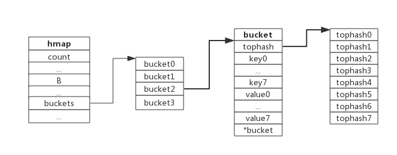
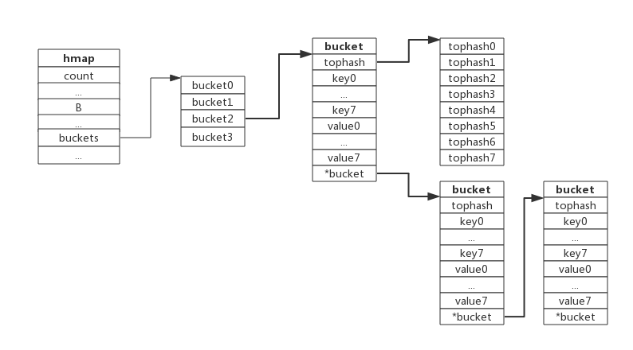
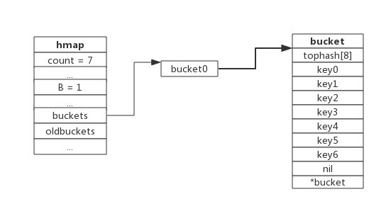
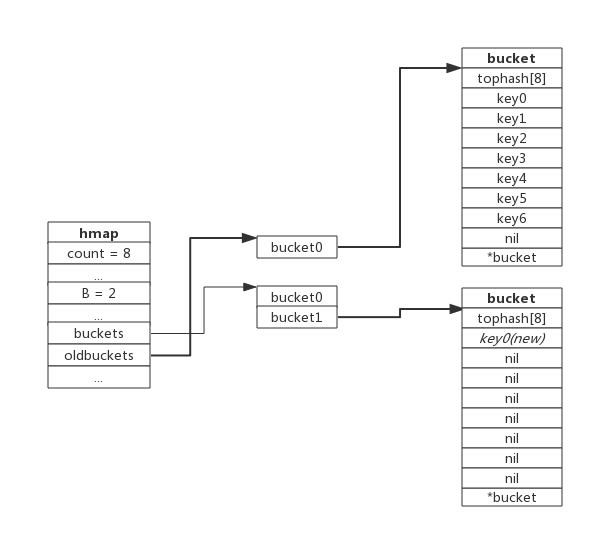
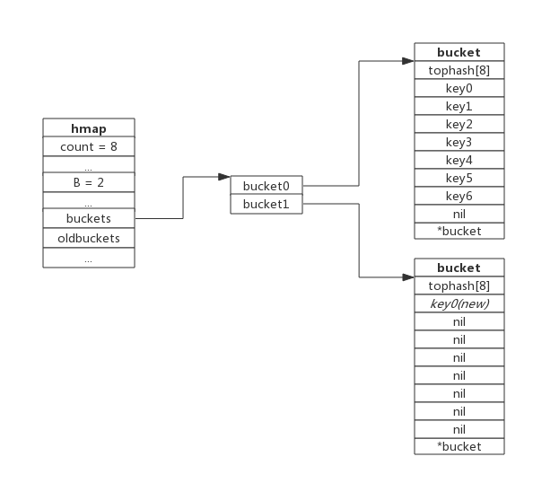
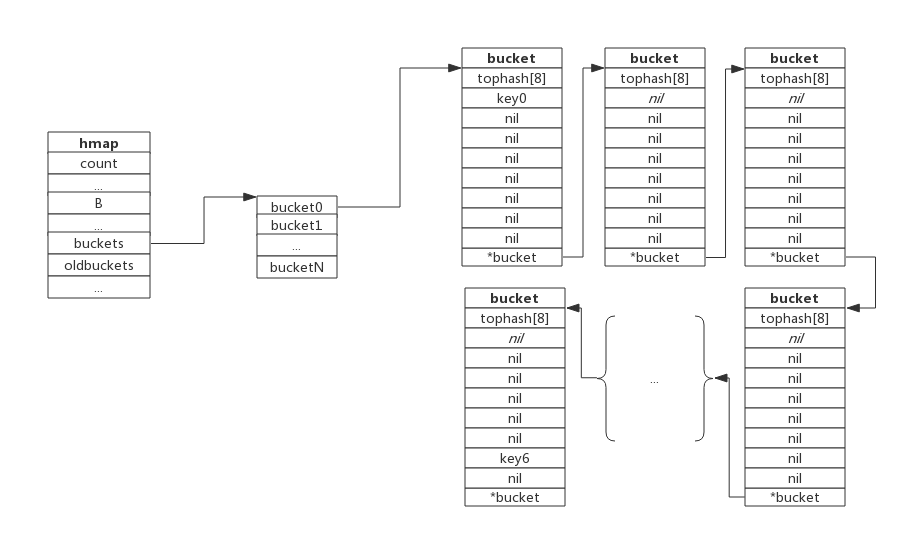

# 1. map数据结构
Golang的map使用哈希表作为底层实现，一个哈希表里可以有多个哈希表节点，也即bucket，而每个bucket就保存了map中的一个或一组键值对。

map数据结构由`runtime/map.go:hmap`定义:
```go
type hmap struct {
	count     int // 当前保存的元素个数
	...
	B         uint8
	...
	buckets    unsafe.Pointer // bucket数组指针，数组的大小为2^B
	...
}
```

下图展示一个拥有4个bucket的map：



本例中, `hmap.B=2`， 而hmap.buckets长度是2^B为4. 元素经过哈希运算后会落到某个bucket中进行存储。查找过程类似。

`bucket`很多时候被翻译为桶，所谓的`哈希桶`实际上就是bucket。

# 2. bucket数据结构
bucket数据结构由`runtime/map.go:bmap`定义：
```go
type bmap struct {
	tophash [8]uint8 //存储哈希值的高8位
	data    byte[1]  //key value数据:key/key/key/.../value/value/value...
	overflow *bmap   //溢出bucket的地址
}
```
每个bucket可以存储8个键值对。
- tophash是个长度为8的数组，哈希值相同的键（准确的说是哈希值低位相同的键）存入当前bucket时会将哈希值的高位存储在该数组中，以方便后续匹配。
- data区存放的是key-value数据，存放顺序是key/key/key/...value/value/value，如此存放是为了节省字节对齐带来的空间浪费。
- overflow 指针指向的是下一个bucket，据此将所有冲突的键连接起来。

注意：上述中data和overflow并不是在结构体中显示定义的，而是直接通过指针运算进行访问的。

下图展示bucket存放8个key-value对：



# 3. 哈希冲突
当有两个或以上数量的键被哈希到了同一个bucket时，我们称这些键发生了冲突。Go使用链地址法来解决键冲突。
由于每个bucket可以存放8个键值对，所以同一个bucket存放超过8个键值对时就会再创建一个键值对，用类似链表的方式将bucket连接起来。

下图展示产生冲突后的map：



bucket数据结构指示下一个bucket的指针称为overflow bucket，意为当前bucket盛不下而溢出的部分。事实上哈希冲突并不是好事情，它降低了存取效率，好的哈希算法可以保证哈希值的随机性，但冲突过多也是要控制的，后面会再详细介绍。

# 4. 负载因子
负载因子用于衡量一个哈希表冲突情况，公式为：
```go
负载因子 = 键数量/bucket数量
```
例如，对于一个bucket数量为4，包含4个键值对的哈希表来说，这个哈希表的负载因子为1.

哈希表需要将负载因子控制在合适的大小，超过其阀值需要进行rehash，也即键值对重新组织：
- 哈希因子过小，说明空间利用率低
- 哈希因子过大，说明冲突严重，存取效率低

每个哈希表的实现对负载因子容忍程度不同，比如Redis实现中负载因子大于1时就会触发rehash，而Go则在在负载因子达到6.5时才会触发rehash，因为Redis的每个bucket只能存1个键值对，而Go的bucket可能存8个键值对，所以Go可以容忍更高的负载因子。

# 5. 渐进式扩容
## 5.1 扩容的前提条件
为了保证访问效率，当新元素将要添加进map时，都会检查是否需要扩容，扩容实际上是以空间换时间的手段。
触发扩容的条件有二个：
1. 负载因子 > 6.5时，也即平均每个bucket存储的键值对达到6.5个。
2. overflow数量 > 2^15时，也即overflow数量超过32768时。

## 5.2 增量扩容
当负载因子过大时，就新建一个bucket，新的bucket长度是原来的2倍，然后旧bucket数据搬迁到新的bucket。
考虑到如果map存储了数以亿计的key-value，一次性搬迁将会造成比较大的延时，Go采用逐步搬迁策略，即每次访问map时都会触发一次搬迁，每次搬迁2个键值对。

下图展示了包含一个bucket满载的map(为了描述方便，图中bucket省略了value区域):



当前map存储了7个键值对，只有1个bucket。此地负载因子为7。再次插入数据时将会触发扩容操作，扩容之后再将新插入键写入新的bucket。

当第8个键值对插入时，将会触发扩容，扩容后示意图如下：



hmap数据结构中oldbuckets成员指身原bucket，而buckets指向了新申请的bucket。新的键值对被插入新的bucket中。
后续对map的访问操作会触发迁移，将oldbuckets中的键值对逐步的搬迁过来。当oldbuckets中的键值对全部搬迁完毕后，删除oldbuckets。

搬迁完成后的示意图如下：



数据搬迁过程中原bucket中的键值对将存在于新bucket的前面，新插入的键值对将存在于新bucket的后面。
实际搬迁过程中比较复杂，将在后续源码分析中详细介绍。

## 5.3 等量扩容
所谓等量扩容，实际上并不是扩大容量，buckets数量不变，重新做一遍类似增量扩容的搬迁动作，把松散的键值对重新排列一次，以使bucket的使用率更高，进而保证更快的存取。
在极端场景下，比如不断地增删，而键值对正好集中在一小部分的bucket，这样会造成overflow的bucket数量增多，但负载因子又不高，从而无法执行增量搬迁的情况，如下图所示：



上图可见，overflow的bucket中大部分是空的，访问效率会很差。此时进行一次等量扩容，即buckets数量不变，经过重新组织后overflow的bucket数量会减少，即节省了空间又会提高访问效率。

# 6. 查找过程
查找过程如下：
1. 根据key值算出哈希值
2. 取哈希值低位与hmap.B取模确定bucket位置
3. 取哈希值高位在tophash数组中查询
4. 如果tophash[i]中存储值也哈希值相等，则去找到该bucket中的key值进行比较
5. 当前bucket没有找到，则继续从下个overflow的bucket中查找。
6. 如果当前处于搬迁过程，则优先从oldbuckets查找

注：如果查找不到，也不会返回空值，而是返回相应类型的0值。

# 7. 插入过程
新元素插入过程如下：
1. 根据key值算出哈希值
2. 取哈希值低位与hmap.B取模确定bucket位置
3. 查找该key是否已经存在，如果存在则直接更新值
4. 如果没找到将key，将key插入
