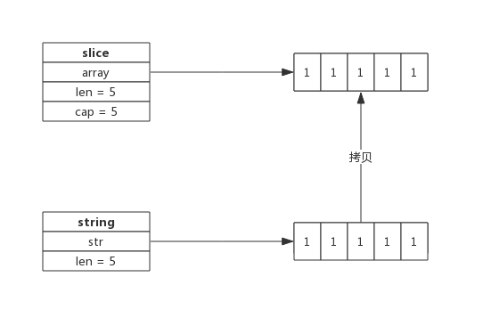

## string标准概念
Go标准库`builtin`给出了所有内置类型的定义。
源代码位于`src/builtin/builtin.go`，其中关于string的描述如下:
```go
// string is the set of all strings of 8-bit bytes, conventionally but not
// necessarily representing UTF-8-encoded text. A string may be empty, but
// not nil. Values of string type are immutable.
type string string
```
所以string是8比特字节的集合，通常是但并不一定非得是UTF-8编码的文本。

另外，还提到了两点，非常重要：
* string可以为空（长度为0），但不会是nil；
* string对象不可以修改。

## string 数据结构
源码包`src/runtime/string.go:stringStruct`定义了string的数据结构：
```go
type stringStruct struct {
	str unsafe.Pointer
	len int
}
```
其数据结构很简单：
* stringStruct.str：字符串的首地址；
* stringStruct.len：字符串的长度；

string数据结构跟切片有些类似，只不过切片还有一个表示容量的成员，事实上string和切片，准确的说是byte切片经常发生转换。这个后面再详细介绍。

## string操作

### 声明
如下代码所示，可以声明一个string变量变赋予初值：
```go
    var str string
    str = "Hello World"
```

字符串构建过程是先根据字符串构建stringStruct，再转换成string。转换的源码如下：
```go
func gostringnocopy(str *byte) string { // 根据字符串地址构建string
	ss := stringStruct{str: unsafe.Pointer(str), len: findnull(str)} // 先构造stringStruct
	s := *(*string)(unsafe.Pointer(&ss))                             // 再将stringStruct转换成string
	return s
}
```
string在runtime包中就是stringStruct，对外呈现叫做string。

### []byte转string
byte切片可以很方便的转换成string，如下所示：
```go
func GetStringBySlice(s []byte) string {
    return string(s)
}
```
需要注意的是这种转换需要一次内存拷贝。

转换过程如下：
1. 根据切片的长度申请内存空间，假设内存地址为p，切片长度为len(b)；
2. 构建string（string.str = p；string.len = len；）
3. 拷贝数据(切片中数据拷贝到新申请的内存空间)

转换示意图：


### string转[]byte
string也可以方便的转成byte切片，如下所示：
```go
func GetSliceByString(str string) []byte {
    return []byte(str)
}
```

string转换成byte切片，也需要一次内存拷贝，其过程如下：
* 申请切片内存空间
* 将string拷贝到切片

转换示意图：



### 字符串拼接
字符串可以很方便的拼接，像下面这样：
```go
str := "Str1" + "Str2" + "Str3"
```

即便有非常多的字符串需要拼接，性能上也有比较好的保证，因为新字符串的内存空间是一次分配完成的，所以性能消耗主要在拷贝数据上。

一个拼接语句的字符串编译时都会被存放到一个切片中，拼接过程需要遍历两次切片，第一次遍历获取总的字符串长度，据此申请内存，第二次遍历会把字符串逐个拷贝过去。

字符串拼接伪代码如下：
```go
func concatstrings(a []string) string { // 字符串拼接
    length := 0        // 拼接后总的字符串长度

    for _, str := range a {
        length += len(str)
    }

    s, b := rawstring(length) // 生成指定大小的字符串，返回一个string和切片，二者共享内存空间

    for _, str := range a {
        copy(b, str)    // string无法修改，只能通过切片修改
        b = b[len(str):]
    }

    return s
}
```
因为string是无法直接修改的，所以这里使用rawstring()方法初始化一个指定大小的string，同时返回一个切片，二者共享同一块内存空间，后面向切片中拷贝数据，也就间接修改了string。

rawstring()源代码如下：
```go
func rawstring(size int) (s string, b []byte) { // 生成一个新的string，返回的string和切片共享相同的空间
	p := mallocgc(uintptr(size), nil, false)

	stringStructOf(&s).str = p
	stringStructOf(&s).len = size

	*(*slice)(unsafe.Pointer(&b)) = slice{p, size, size}

	return
}
```

## 为什么字符串不允许修改？
像C++语言中的string，其本身拥有内存空间，修改string是支持的。但Go的实现中，string不包含内存空间，只有一个内存的指针，这样做的好处是string变得非常轻量，可以很方便的进行传递而不用担心内存拷贝。

因为string通常指向字符串字面量，而字符串字面量存储位置是只读段，而不是堆或栈上，所以才有了string不可修改的约定。

## []byte转换成string一定会拷贝内存吗？
byte切片转换成string的场景很多，为了性能上的考虑，有时候只是临时需要字符串的场景下，byte切片转换成string时并不会拷贝内存，而是直接返回一个string，这个string的指针(string.str)指向切片的内存。

比如，编译器会识别如下临时场景：
* 使用m[string(b)]来查找map（map是string为key，临时把切片b转成string）；
* 字符串拼接，如"<" + "string(b)" + ">"；
* 字符串比较：string(b) == "foo"

因为是临时把byte切片转换成string，也就避免了因byte切片同容改成而导致string引用失败的情况，所以此时可以不必拷贝内存新建一个string。

## string和[]byte如何取舍
string和[]byte都可以表示字符串，但因数据结构不同，其衍生出来的方法也不同，要根据实际应用场景来选择。

string 擅长的场景：
* 需要字符串比较的场景；
* 不需要nil字符串的场景；

[]byte擅长的场景：
* 修改字符串的场景，尤其是修改粒度为1个字节；
* 函数返回值，需要用nil表示含义的场景；
* 需要切片操作的场景；

虽然看起来string适用的场景不如[]byte多，但因为string直观，在实际应用中还是大量存在，在偏底层的实现中[]byte使用更多。
