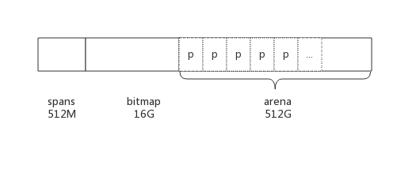
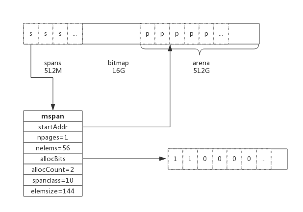
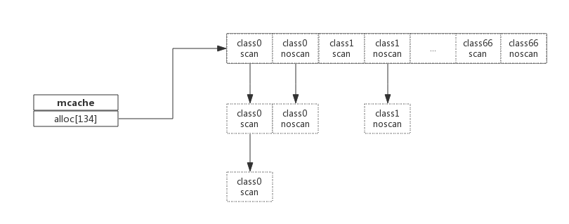
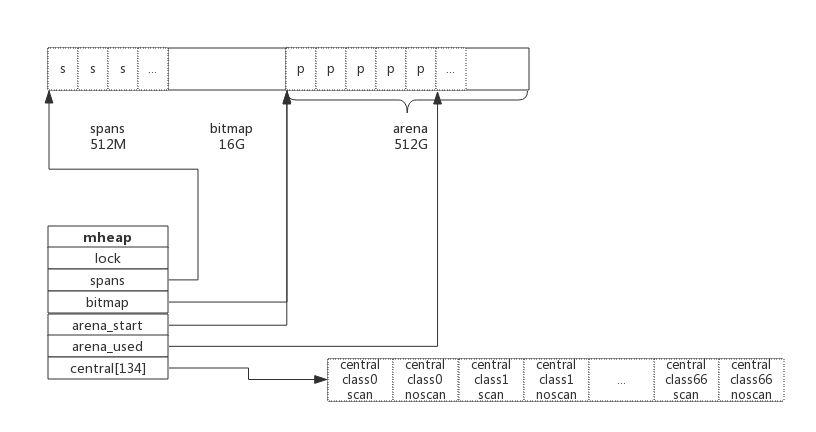

# 1. 前言
编写过C语言程序的肯定知道通过malloc()方法动态申请内存，其中内存分配器使用的是glibc提供的ptmalloc2。
除了glibc，业界比较出名的内存分配器有Google的tcmalloc和Facebook的jemalloc。二者在避免内存碎片和性能上均比glibc有比较大的优势，在多线程环境中效果更明显。

Golang中也实现了内存分配器，原理与tcmalloc类似，简单的说就是维护一块大的全局内存，每个线程(Golang中为P)维护一块小的私有内存，私有内存不足再从全局申请。

另外，内存分配与GC（垃圾回收）关系密切，所以了解GC前有必要了解内存分配的原理。

# 2. 基础概念
为了方便自主管理内存，做法便是先向系统申请一块内存，然后将内存切割成小块，通过一定的内存分配算法管理内存。
以64位系统为例，Golang程序启动时会向系统申请的内存如下图所示：



预申请的内存划分为spans、bitmap、arena三部分。其中arena即为所谓的堆区，应用中需要的内存从这里分配。其中spans和bitmap是为了管理arena区而存在的。

arena的大小为512G，为了方便管理把arena区域划分成一个个的page，每个page为8KB,一共有512GB/8KB个页；

spans区域存放span的指针，每个指针对应一个或多个page，所以span区域的大小为(512GB/8KB)*指针大小8byte = 512M

bitmap区域大小也是通过arena计算出来，不过主要用于GC。

## 2.1 span
span是用于管理arena页的关键数据结构，每个span中包含1个或多个连续页，为了满足小对象分配，span中的一页会划分更小的粒度，而对于大对象比如超过页大小，则通过多页实现。

### 2.1.1 class
根据对象大小，划分了一系列class，每个class都代表一个固定大小的对象，以及每个span的大小。如下表所示：
```go
// class  bytes/obj  bytes/span  objects  waste bytes
//     1          8        8192     1024            0
//     2         16        8192      512            0
//     3         32        8192      256            0
//     4         48        8192      170           32
//     5         64        8192      128            0
//     6         80        8192      102           32
//     7         96        8192       85           32
//     8        112        8192       73           16
//     9        128        8192       64            0
//    10        144        8192       56          128
//    11        160        8192       51           32
//    12        176        8192       46           96
//    13        192        8192       42          128
//    14        208        8192       39           80
//    15        224        8192       36          128
//    16        240        8192       34           32
//    17        256        8192       32            0
//    18        288        8192       28          128
//    19        320        8192       25          192
//    20        352        8192       23           96
//    21        384        8192       21          128
//    22        416        8192       19          288
//    23        448        8192       18          128
//    24        480        8192       17           32
//    25        512        8192       16            0
//    26        576        8192       14          128
//    27        640        8192       12          512
//    28        704        8192       11          448
//    29        768        8192       10          512
//    30        896        8192        9          128
//    31       1024        8192        8            0
//    32       1152        8192        7          128
//    33       1280        8192        6          512
//    34       1408       16384       11          896
//    35       1536        8192        5          512
//    36       1792       16384        9          256
//    37       2048        8192        4            0
//    38       2304       16384        7          256
//    39       2688        8192        3          128
//    40       3072       24576        8            0
//    41       3200       16384        5          384
//    42       3456       24576        7          384
//    43       4096        8192        2            0
//    44       4864       24576        5          256
//    45       5376       16384        3          256
//    46       6144       24576        4            0
//    47       6528       32768        5          128
//    48       6784       40960        6          256
//    49       6912       49152        7          768
//    50       8192        8192        1            0
//    51       9472       57344        6          512
//    52       9728       49152        5          512
//    53      10240       40960        4            0
//    54      10880       32768        3          128
//    55      12288       24576        2            0
//    56      13568       40960        3          256
//    57      14336       57344        4            0
//    58      16384       16384        1            0
//    59      18432       73728        4            0
//    60      19072       57344        3          128
//    61      20480       40960        2            0
//    62      21760       65536        3          256
//    63      24576       24576        1            0
//    64      27264       81920        3          128
//    65      28672       57344        2            0
//    66      32768       32768        1            0
```

上表中每列含义如下：
- class： class ID，每个span结构中都有一个class ID, 表示该span可处理的对象类型
- bytes/obj：该class代表对象的字节数
- bytes/span：每个span占用堆的字节数，也即页数*页大小
- objects: 每个span可分配的对象个数，也即（bytes/spans）/（bytes/obj）
- waste bytes: 每个span产生的内存碎片，也即（bytes/spans）%（bytes/obj）

上表可见最大的对象是32K大小，超过32K大小的由特殊的class表示，该class ID为0，每个class只包含一个对象。

## 2.1.2 span数据结构
span是内存管理的基本单位，每个span用于管理特定的class对象，根据对象大小，span将一个或多个页拆分成多个块进行管理。

`src/runtime/mheap.go:mspan`定义了其数据结构：
```go
type mspan struct {
	next *mspan			//链表前向指针，用于将span链接起来
	prev *mspan			//链表前向指针，用于将span链接起来
	startAddr uintptr // 起始地址，也即所管理页的地址
	npages    uintptr // 管理的页数

	nelems uintptr // 块个数，也即有多少个块可供分配

	allocBits  *gcBits //分配位图，每一位代表一个块是否已分配

	allocCount  uint16     // 已分配块的个数
	spanclass   spanClass  // class表中的class ID

	elemsize    uintptr    // class表中的对象大小，也即块大小
}
```

以class 10为例，span和管理的内存如下图所示：



spanclass为10，参照class表可得出npages=1,nelems=56,elemsize为144。其中startAddr是在span初始化时就指定了某个页的地址。allocBits指向一个位图，每位代表一个块是否被分配，本例中有两个块已经被分配，其allocCount也为2。

next和prev用于将多个span链接起来，这有利于管理多个span，接下来会进行说明。

## 2.2 cache
有了管理内存的基本单位span，还要有个数据结构来管理span，这个数据结构叫mcentral，各线程需要内存时从mcentral管理的span中申请内存，为了避免多线程申请内存时不断地加锁，Golang为每个线程分配了span的缓存，这个缓存即是cache。

`src/runtime/mcache.go:mcache`定义了cache的数据结构：
```go
type mcache struct {
	alloc [67*2]*mspan // 按class分组的mspan列表
}
```
alloc为mspan的指针数组，数组大小为class总数的2倍。数组中每个元素代表了一种class类型的span列表，每种class类型都有两组span列表，第一组列表中所表示的对象中包含了指针，第二组列表中所表示的对象不含有指针，这么做是为了提高GC扫描性能，对于不包含指针的span列表，没必要去扫描。

根据对象是否包含指针，将对象分为noscan和scan两类，其中noscan代表没有指针，而scan则代表有指针，需要GC进行扫描。

mcache和span的对应关系如下图所示：



mcache在初始化时是没有任何span的，在使用过程中会动态地从central中获取并缓存下来，根据使用情况，每种class的span个数也不相同。上图所示，class 0的span数比class1的要多，说明本线程中分配的小对象要多一些。

## 2.3 central
cache作为线程的私有资源为单个线程服务，而central则是全局资源，为多个线程服务，当某个线程内存不足时会向central申请，当某个线程释放内存时又会回收进central。

`src/runtime/mcentral.go:mcentral`定义了central数据结构：
```go
type mcentral struct {
	lock      mutex     //互斥锁
	spanclass spanClass // span class ID
	nonempty  mSpanList // non-empty 指还有空闲块的span列表
	empty     mSpanList // 指没有空闲块的span列表

	nmalloc uint64      // 已累计分配的对象个数
}
```
- lock: 线程间互斥锁，防止多线程读写冲突
- spanclass : 每个mcentral管理着一组有相同class的span列表
- nonempty: 指还有内存可用的span列表
- empty: 指没有内存可用的span列表
- nmalloc: 指累计分配的对象个数

线程从central获取span步骤如下：
1. 加锁
2. 从nonempty列表获取一个可用span，并将其从链表中删除
3. 将取出的span放入empty链表
4. 将span返回给线程
5. 解锁
6. 线程将该span缓存进cache

线程将span归还步骤如下：
1. 加锁
2. 将span从empty列表删除
3. 将span加入noneempty列表
4. 解锁

上述线程从central中获取span和归还span只是简单流程，为简单起见，并未对具体细节展开。

## 2.4 heap
从mcentral数据结构可见，每个mcentral对象只管理特定的class规格的span。事实上每种class都会对应一个mcentral,这个mcentral的集合存放于mheap数据结构中。

`src/runtime/mheap.go:mheap`定义了heap的数据结构：
```go
type mheap struct {
	lock      mutex

	spans []*mspan

	bitmap        uintptr 	//指向bitmap首地址，bitmap是从高地址向低地址增长的

	arena_start uintptr		//指示arena区首地址
	arena_used  uintptr		//指示arena区已使用地址位置

	central [67*2]struct {
		mcentral mcentral
		pad      [sys.CacheLineSize - unsafe.Sizeof(mcentral{})%sys.CacheLineSize]byte
	}
}
```
- lock： 互斥锁
- spans: 指向spans区域，用于映射span和page的关系
- bitmap：bitmap的起始地址
- arena_start: arena区域首地址
- arena_used: 当前arena已使用区域的最大地址
- central: 每种class对应的两个mcentral

从数据结构可见，mheap管理着全部的内存，事实上Golang就是通过一个mheap类型的全局变量进行内存管理的。

mheap内存管理示意图如下：



系统预分配的内存分为spans、bitmap、arean三个区域，通过mheap管理起来。接下来看内存分配过程。

# 3. 内存分配过程
针对待分配对象的大小不同有不同的分配逻辑：
- (0, 16B) 且不包含指针的对象： Tiny分配
- (0, 16B) 包含指针的对象：正常分配
- [16B, 32KB] : 正常分配
- (32KB, -) : 大对象分配
其中Tiny分配和大对象分配都属于内存管理的优化范畴，这里暂时仅关注一般的分配方法。

以申请size为n的内存为例，分配步骤如下：
1. 获取当前线程的私有缓存mcache
2. 根据size计算出适合的class的ID
3. 从mcache的alloc[class]链表中查询可用的span
4. 如果mcache没有可用的span则从mcentral申请一个新的span加入mcache中
5. 如果mcentral中也没有可用的span则从mheap中申请一个新的span加入mcentral
6. 从该span中获取到空闲对象地址并返回

# 4. 总结
Golang内存分配是个相当复杂的过程，其中还掺杂了GC的处理，这里仅仅对其关键数据结构进行了说明，了解其原理而又不至于深陷实现细节。

1. Golang程序启动时申请一大块内存，并划分成spans、bitmap、arena区域
2. arena区域按页划分成一个个小块
3. span管理一个或多个页
4. mcentral管理多个span供线程申请使用
5. mcache作为线程私有资源，资源来源于mcentral
