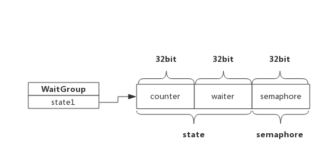

# 1 前言
WaitGroup是Golang应用开发过程中经常使用的并发控制技术。

WaitGroup，可理解为Wait-Goroutine-Group，即等待一组goroutine结束。比如某个goroutine需要等待其他几个goroutine全部完成，那么使用WaitGroup可以轻松实现。

下面程序展示了一个goroutine等待另外两个goroutine结束的例子：
```go
package main

import (
    "fmt"
    "time"
    "sync"
)

func main() {
    var wg sync.WaitGroup

    wg.Add(2) //设置计数器，数值即为goroutine的个数
    go func() {
        //Do some work
        time.Sleep(1*time.Second)

        fmt.Println("Goroutine 1 finished!")
        wg.Done() //goroutine执行结束后将计数器减1
    }()

    go func() {
        //Do some work
        time.Sleep(2*time.Second)

        fmt.Println("Goroutine 2 finished!")
        wg.Done() //goroutine执行结束后将计数器减1
    }()

    wg.Wait() //主goroutine阻塞等待计数器变为0
    fmt.Printf("All Goroutine finished!")
}
```
简单的说，上面程序中wg内部维护了一个计数器：
1. 启动goroutine前将计数器通过Add(2)将计数器设置为待启动的goroutine个数。
2. 启动goroutine后，使用Wait()方法阻塞自己，等待计数器变为0。
3. 每个goroutine执行结束通过Done()方法将计数器减1。
4. 计数器变为0后，阻塞的goroutine被唤醒。

其实WaitGroup也可以实现一组goroutine等待另一组goroutine，这有点像玩杂技，很容出错，如果不了解其实现原理更是如此。实际上，WaitGroup的实现源码非常简单。

# 2 基础知识
## 2.1 信号量
信号量是Unix系统提供的一种保护共享资源的机制，用于防止多个线程同时访问某个资源。

可简单理解为信号量为一个数值：
- 当信号量>0时，表示资源可用，获取信号量时系统自动将信号量减1；
- 当信号量==0时，表示资源暂不可用，获取信号量时，当前线程会进入睡眠，当信号量为正时被唤醒；

由于WaitGroup实现中也使用了信号量，在此做个简单介绍。

# 3 WaitGroup
## 3.1 数据结构
源码包中`src/sync/waitgroup.go:WaitGroup`定义了其数据结构：
```go
type WaitGroup struct {
	state1 [3]uint32
}
```
state1是个长度为3的数组，其中包含了state和一个信号量，而state实际上是两个计数器：
- counter： 当前还未执行结束的goroutine计数器
- waiter count: 等待goroutine-group结束的goroutine数量，即有多少个等候者
- semaphore: 信号量

考虑到字节是否对齐，三者出现的位置不同，为简单起见，依照字节已对齐情况下，三者在内存中的位置如下所示：



WaitGroup对外提供三个接口：
- Add(delta int): 将delta值加到counter中
- Wait()： waiter递增1，并阻塞等待信号量semaphore
- Done()： counter递减1，按照waiter数值释放相应次数信号量

下面分别介绍这三个函数的实现细节。

## 3.2 Add(delta int)
Add()做了两件事，一是把delta值累加到counter中，因为delta可以为负值，也就是说counter有可能变成0或负值，所以第二件事就是当counter值变为0时，根据waiter数值释放等量的信号量，把等待的goroutine全部唤醒，如果counter变为负值，则panic.

Add()伪代码如下：
```go
func (wg *WaitGroup) Add(delta int) {
    statep, semap := wg.state() //获取state和semaphore地址指针

    state := atomic.AddUint64(statep, uint64(delta)<<32) //把delta左移32位累加到state，即累加到counter中
    v := int32(state >> 32) //获取counter值
    w := uint32(state)      //获取waiter值

    if v < 0 {              //经过累加后counter值变为负值，panic
        panic("sync: negative WaitGroup counter")
    }

    //经过累加后，此时，counter >= 0
    //如果counter为正，说明不需要释放信号量，直接退出
    //如果waiter为零，说明没有等待者，也不需要释放信号量，直接退出
    if v > 0 || w == 0 {
        return
    }

    //此时，counter一定等于0，而waiter一定大于0（内部维护waiter，不会出现小于0的情况），
    //先把counter置为0，再释放waiter个数的信号量
    *statep = 0
    for ; w != 0; w-- {
        runtime_Semrelease(semap, false) //释放信号量，执行一次释放一个，唤醒一个等待者
    }
}
```


## 3.3 Wait()
Wait()方法也做了两件事，一是累加waiter, 二是阻塞等待信号量

```go
func (wg *WaitGroup) Wait() {
    statep, semap := wg.state() //获取state和semaphore地址指针
    for {
        state := atomic.LoadUint64(statep) //获取state值
        v := int32(state >> 32)            //获取counter值
        w := uint32(state)                 //获取waiter值
        if v == 0 {                        //如果counter值为0，说明所有goroutine都退出了，不需要待待，直接返回
            return
        }

        // 使用CAS（比较交换算法）累加waiter，累加可能会失败，失败后通过for loop下次重试
        if atomic.CompareAndSwapUint64(statep, state, state+1) {
            runtime_Semacquire(semap) //累加成功后，等待信号量唤醒自己
            return
        }
    }
}
```

这里用到了CAS算法保证有多个goroutine同时执行Wait()时也能正确累加waiter。

## 3.4 Done()
Done()只做一件事，即把counter减1，我们知道Add()可以接受负值，所以Done实际上只是调用了Add(-1)。

源码如下：
```go
func (wg *WaitGroup) Done() {
	wg.Add(-1)
}
```
Done()的执行逻辑就转到了Add()，实际上也正是最后一个完成的goroutine把等待者唤醒的。

# 4 编程Tips

- Add()操作必须早于Wait(), 否则会panic
- Add()设置的值必须与实际等待的goroutine个数一致，否则会panic

