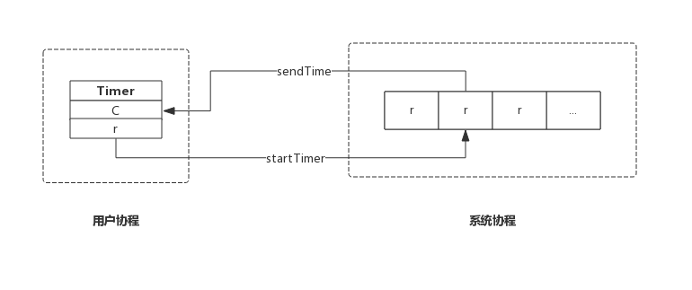
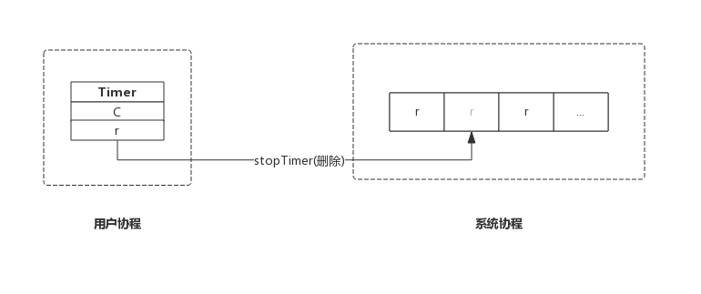
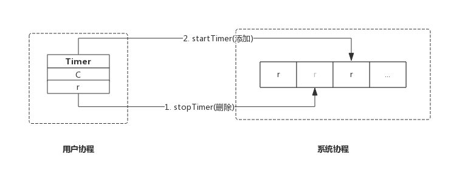

## 前言
本节我们从Timer数据结构入手，结合源码分析Timer的实现原理。

很多人想当然的以为，启动一个Timer意味着启动了一个协程，这个协程会等待Timer到期，然后向Timer的管道中发送当前时间。

实际上，每个Go应用程序都有一个协程专门负责管理所有的Timer，这个协程负责监控Timer是否过期，过期后执行一个预定义的动作，这个动作对于Timer而言就是发送当前时间到管道中。

## 数据结构
### Timer
源码包`src/time/sleep.go:Timer`定义了其数据结构：
```go
type Timer struct {
	C <-chan Time
	r runtimeTimer
}
```
Timer只有两个成员：
* C: 管道，上层应用根据此管道接收事件；
* r: runtime定时器，该定时器即系统管理的定时器，对上层应用不可见；

这里应该按照层次来理解Timer数据结构，Timer.C即面向Timer用户的，Timer.r是面向底层的定时器实现。

### runtimeTimer
前面我们说过，创建一个Timer实质上是把一个定时任务交给专门的协程进行监控，这个任务的载体便是`runtimeTimer`，简单的讲，每创建一个Timer意味着创建一个runtimeTimer变量，然后把它交给系统进行监控。我们通过设置runtimeTimer过期后的行为来达到定时的目的。

源码包`src/time/sleep.go:runtimeTimer`定义了其数据结构：
```go
type runtimeTimer struct {
	tb uintptr                          // 存储当前定时器的数组地址
	i  int                              // 存储当前定时器的数组下标

	when   int64                        // 当前定时器触发时间
	period int64                        // 当前定时器周期触发间隔
	f      func(interface{}, uintptr)   // 定时器触发时执行的函数
	arg    interface{}                  // 定时器触发时执行函数传递的参数一
	seq    uintptr                      // 定时器触发时执行函数传递的参数二(该参数只在网络收发场景下使用)
}
```
其成员如下：
* tb: 系统底层存储runtimeTimer的数组地址；
* i: 当前runtimeTimer在tb数组中的下标；
* when: 定时器触发事件的时间；
* period: 定时器周期性触发间隔（对于Timer来说，此值恒为0）；
* f: 定时器触发时执行的回调函数，回调函数接收两个参数；
* arg: 定时器触发时执行回调函数的参数一；
* seq: 定时器触发时执行回调函数的参数二（Timer并不使用该参数）；

## 实现原理
一个进程中的多个Timer都由底层的一个协程来管理，为了描述方便我们把这个协程称为系统协程。

我们想在后面的章节中单独介绍系统协程工作机制，本节，我们先简单介绍其工作过程。

系统协程把runtimeTimer存放在数组中，并按照`when`字段对所有的runtimeTimer进行堆排序，定时器触发时执行runtimeTimer中的预定义函数`f`，即完成了一次定时任务。

### 创建Timer
我们来看创建Timer的实现，非常简单：
```go
func NewTimer(d Duration) *Timer {
	c := make(chan Time, 1)  // 创建一个管道
	t := &Timer{ // 构造Timer数据结构
		C: c,               // 新创建的管道
		r: runtimeTimer{
			when: when(d),  // 触发时间
			f:    sendTime, // 触发后执行函数sendTime
			arg:  c,        // 触发后执行函数sendTime时附带的参数
		},
	}
	startTimer(&t.r) // 此处启动定时器，只是把runtimeTimer放到系统协程的堆中，由系统协程维护
	return t
}
```
NewTimer()只是构造了一个Timer，然后把Timer.r通过startTimer()交给系统协程维护。

其中when()方法是计算下一次定时器触发的绝对时间，即当前时间+NewTimer()参数d。

其中sendTime()方法便是定时器触发时的动作：
```go
func sendTime(c interface{}, seq uintptr) {
    select {
    case c.(chan Time) <- Now():
    default:
    }
}
```
sendTime接收一个管道作为参数，其主要任务是向管道中写入当前时间。

创建Timer时生成的管道含有一个缓冲区（`make(chan Time, 1)`），所以Timer触发时向管道写入时间永远不会阻塞，sendTime写完即退出。

之所以sendTime()使用select并搭配一个空的default分支，是因为后面所要讲的Ticker也复用sendTime()，Ticker触发时也会向管道中写入时间，但无法保证之前的数据已被取走，所以使用select并搭配一个空的default分支，确保sendTime()不会阻塞，Ticker触发时，如果管道中还有值，则本次不再向管道中写入时间，本次触发的事件直接丢弃。

`startTimer(&t.r)`的具体实现在runtime包，其主要作用是把runtimeTimer写入到系统协程的数组中，并启动系统协程（如果系统协程还未开始运行的话）。更详细的内容，待后面讲解系统协程时再介绍。

综上，创建一个Timer示意图如下：



### 停止Timer
停止Timer，只是简单的把Timer从系统协程中移除。函数主要实现如下：
```go
func (t *Timer) Stop() bool {
	return stopTimer(&t.r)
}
```
stopTimer()即通知系统协程把该Timer移除，即不再监控。系统协程只是移除Timer并不会关闭管道，以避免用户协程读取错误。

系统协程监控Timer是否需要触发，Timer触发后，系统协程会删除该Timer。所以在Stop()执行时有两种情况：
* Timer还未触发，系统协程已经删除该Timer，Stop()返回false；
* Timer已经触发，系统协程还未删除该Timer，Stop()返回true;

综上，停止一个Timer示意图如下：



### 重置Timer
重置Timer时会先把timer从系统协程中删除，修改新的时间后重新添加到系统协程中。

重置函数主要实现如下所示：
```go
func (t *Timer) Reset(d Duration) bool {
    w := when(d)
    active := stopTimer(&t.r)
    t.r.when = w
    startTimer(&t.r)
    return active
}
```
其返回值与Stop()保持一致，即如果Timer成功停止，则返回true，如果Timer已经触发，则返回false。

重置一个Timer示意图如下：



由于新加的Timer时间很可能变化，所以其在系统协程的位置也会发生变化。

需要注意的是，按照官方说明，Reset()应该作用于已经停掉的Timer或者已经触发的Timer，按照这个约定其返回值将总是返回false，之所以仍然保留是为了保持向前兼容，使用老版本Go编写的应用不需要因为Go升级而修改代码。

如果不按照此约定使用Reset()，有可能遇到Reset()和Timer触发同时执行的情况，此时有可能会收到两个事件，从而对应用程序造成一些负面影响，使用时一定要注意。

## 总结

- NewTimer()创建一个新的Timer交给系统协程监控；
- Stop()通知系统协程删除指定的Timer;
- Reset()通知系统协程删除指定的Timer并再添加一个新的Timer；
