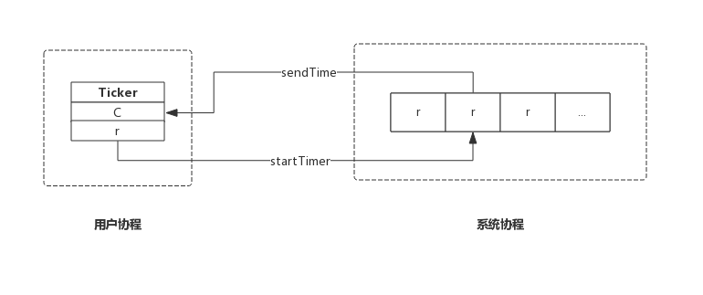

## 前言
本节我们从Ticker数据结构入手，结合源码分析Ticker的实现原理。

实际上，Ticker与之前讲的Timer几乎完全相同，无论数据结构和内部实现机制都相同，唯一不同的是创建方式。

Timer创建时，不指定事件触发周期，事件触发后Timer自动销毁。而Ticker创建时会指定一个事件触发周期，事件会按照这个周期触发，如果不显式停止，定时器永不停止。

## 数据结构
### Ticker
Ticker数据结构与Timer除名字不同外完全一样。

源码包`src/time/tick.go:Ticker`定义了其数据结构：
```go
type Ticker struct {
	C <-chan Time // The channel on which the ticks are delivered.
	r runtimeTimer
}
```
Ticker只有两个成员：
* C: 管道，上层应用根据此管道接收事件；
* r: runtime定时器，该定时器即系统管理的定时器，对上层应用不可见；

这里应该按照层次来理解Ticker数据结构，Ticker.C即面向Ticker用户的，Ticker.r是面向底层的定时器实现。

### runtimeTimer
runtimeTimer也与Timer一样，这里不再赘述。

## 实现原理

### 创建Ticker
我们来看创建Ticker的实现，非常简单：
```go
func NewTicker(d Duration) *Ticker {
	if d <= 0 {
		panic(errors.New("non-positive interval for NewTicker"))
	}
	// Give the channel a 1-element time buffer.
	// If the client falls behind while reading, we drop ticks
	// on the floor until the client catches up.
	c := make(chan Time, 1)
	t := &Ticker{
		C: c,
		r: runtimeTimer{
			when:   when(d),
			period: int64(d), // Ticker跟Timer的重要区就是提供了period这个参数，据此决定timer是一次性的，还是周期性的
			f:      sendTime,
			arg:    c,
		},
	}
	startTimer(&t.r)
	return t
}
```
NewTicker()只是构造了一个Ticker，然后把Ticker.r通过startTimer()交给系统协程维护。

其中period为事件触发的周期。

其中sendTime()方法便是定时器触发时的动作：
```go
func sendTime(c interface{}, seq uintptr) {
    select {
    case c.(chan Time) <- Now():
    default:
    }
}
```
sendTime接收一个管道作为参数，其主要任务是向管道中写入当前时间。

创建Ticker时生成的管道含有一个缓冲区（`make(chan Time, 1)`），但是Ticker触发的事件却是周期性的，如果管道中的数据没有被取走，那么sendTime()也不会阻塞，而是直接退出，带来的后果是本次事件会丢失。

综上，创建一个Ticker示意图如下：



### 停止Ticker
停止Ticker，只是简单的把Ticker从系统协程中移除。函数主要实现如下：
```go
func (t *Ticker) Stop() {
	stopTimer(&t.r)
}
```
stopTicker()即通知系统协程把该Ticker移除，即不再监控。系统协程只是移除Ticker并不会关闭管道，以避免用户协程读取错误。

与Timer不同的是，Ticker停止时没有返回值，即不需要关注返回值，实际上返回值也没啥用途。

综上，停止一个Ticker示意图如下：


Ticker没有重置接口，也即Ticker创建后不能通过重置修改周期。

需要格外注意的是Ticker用完后必须主动停止，否则会产生资源泄露，会持续消耗CPU资源。

## 总结

- NewTicker()创建一个新的Ticker交给系统协程监控；
- Stop()通知系统协程删除指定的Ticker;

> 赠人玫瑰手留余香，如果觉得不错请给个赞~
>
> 本篇文章已归档到GitHub项目，求星~ [点我即达](https://github.com/RainbowMango/GoExpertProgramming)
