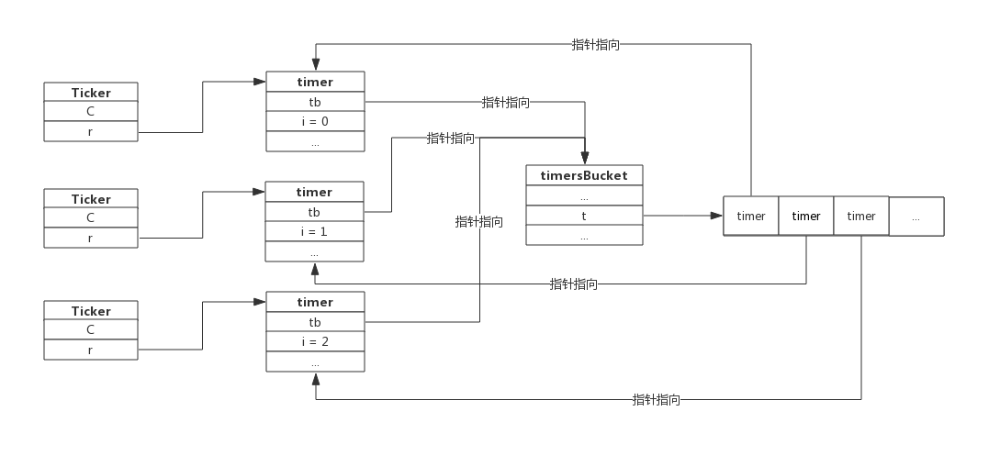
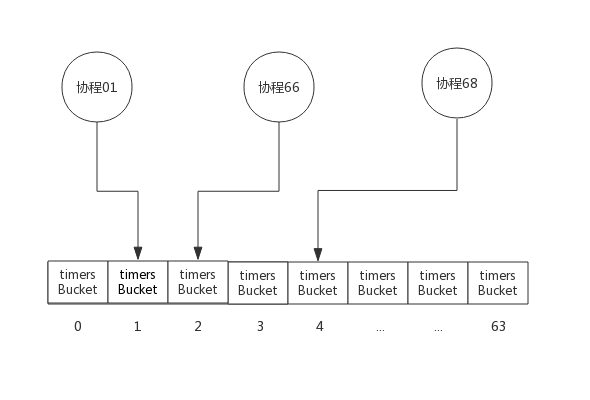
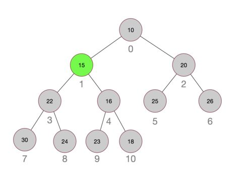
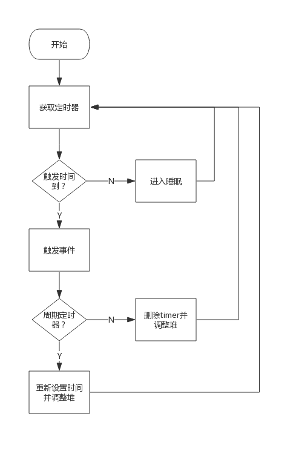

## 前言
前面我们介绍了一次性定时器Timer和周期性定时器Ticker，这两种定时器内部实现机制完全相同。创建定时器的协程并不负责计时，而是把任务交给系统协程，系统协程统一处理所有的定时器。

本节，我们重点关注系统协程是如何管理这些定器的，包括以下问题：
- 定时器使用什么数据结构存储？
- 定时器如何触发事件？
- 定时器如何添加进系统协程？
- 定时器如何从系统协程中删除？

## 定时器存储
### timer数据结构
Timer和Ticker数据结构除名字外完全一样，二者都含有一个`runtimeTimer`类型的成员，这个就是系统协程所维护的对象。
`runtimeTimer`类型是`time`包的名称，在runtime包中，这个类型叫做`timer`。

`timer`数据结构如下所示：
```go
type timer struct {
    tb *timersBucket // the bucket the timer lives in   // 当前定时器寄存于系统timer堆的地址
    i  int           // heap index                      // 当前定时器寄存于系统timer堆的下标

    when   int64                                        // 当前定时器下次触发时间
    period int64                                        // 当前定时器周期触发间隔（如果是Timer，间隔为0，表示不重复触发）
    f      func(interface{}, uintptr)                 // 定时器触发时执行的函数
    arg    interface{}                                // 定时器触发时执行函数传递的参数一
    seq    uintptr                                     // 定时器触发时执行函数传递的参数二(该参数只在网络收发场景下使用)
}
```
其中`timersBucket`便是系统协程存储timer的容器，里面有个切片来存储timer，而`i`便是timer所在切片的下标。

### timersBucket数据结构
我们来看一下`timersBucket`数据结构：
```go
type timersBucket struct {
	lock         mutex
	gp           *g          // 处理堆中事件的协程
	created      bool        // 事件处理协程是否已创建，默认为false，添加首个定时器时置为true
	sleeping     bool        // 事件处理协程（gp）是否在睡眠(如果t中有定时器，还未到触发的时间，那么gp会投入睡眠)
	rescheduling bool        // 事件处理协程（gp）是否已暂停（如果t中定时器均已删除，那么gp会暂停）
	sleepUntil   int64       // 事件处理协程睡眠时间
	waitnote     note        // 事件处理协程睡眠事件（据此唤醒协程）
	t            []*timer    // 定时器切片
}
```
“Bucket”译成中文意为"桶"，顾名思义，`timersBucket`意为存储timer的容器。

- `lock`: 互斥锁，在timer增加和删除时需要使用；
- `gp`: 事件处理协程，就是我们所说的系统协程，这个协程在首次创建Timer或Ticker时生成；
- `created`: 状态值，表示系统协程是否创建；
- `sleeping`: 系统协程是否在睡眠；
- `rescheduling`: 系统协程是否已暂停；
- `sleepUntil`: 系统协程睡眠到指定的时间（如果有新的定时任务可能会提前唤醒）；
- `waitnote`: 提前唤醒时使用的通知；
- `t`: 保存timer的切片，当调用NewTimer()或NewTicker()时便会有新的timer存到此切片中；

看到这里应该能明白，系统协程在首次创建定时器时创建，定时器存储在切片中，系统协程负责计时并维护这个切片。

### 存储拓扑

以Ticker为例，我们回顾一下Ticker、timer和timersBucket关系，假设我们已经创建了3个Ticker，那么它们之间的关系如下：



用户创建Ticker时会生成一个timer，这个timer指向timersBucket，timersBucket记录timer的指针。

### timersBucket数组
通过timersBucket数据结构可以看到，系统协程负责计时并维护其中的多个timer，一个timersBucket包含一个系统协程。

当系统中定时器非常多时，一个系统协程可能处理能力跟不上，所以Go在实现时实际上提供了多个timersBucket，也就有多个系统协程来处理定时器。

最理想的情况，应该预留`GOMAXPROCS`个timersBucket，以便充分使用CPU资源，但需要根据实际环境动态分配。为了实现简单，Go在实现时预留了64个timersBucket，绝大部分场景下这些足够了。

每当协程创建定时器时，使用协程所属的ProcessID%64来计算定时器存入的timersBucket。

下图三个协程创建定时器时，定时器分布如下图所示：



为描述方便，上图中3个协程均分布于3个Process中。

一般情况下，同一个Process的协程创建的定时器分布于同一个timersBucket中，只有当GOMAXPROCS大于64时才会出现多个Process分布于同一个timersBucket中。

## 定时器运行机制
看完上面的数据结构，了解了timer是如何存储的。现在开始探究定时器内部运作机制。

### 创建定时器
回顾一下定时器创建过程，创建Timer或Ticker实际上分为两步：
1. 创建一个管道
2. 创建一个timer并启动（注意此timer不是Timer，而是系统协程所管理的timer。）

创建管道的部分前面已做过介绍，这里我们重点关注timer的启动部分。

首先，每个timer都必须要归属于某个`timersBucket`的，所以第一步是先选择一个`timersBucket`，选择的算法很简单，将当前协程所属的Processor ID 与`timersBucket`数组长度求模，结果就是`timersBucket`数组的下标。
```go
const timersLen = 64
var timers [timersLen]struct { // timersBucket数组，长度为64
	timersBucket
}
func (t *timer) assignBucket() *timersBucket {
    id := uint8(getg().m.p.ptr().id) % timersLen // Processor ID 与数组长度求模，得到下标
    t.tb = &timers[id].timersBucket
    return t.tb
}
```
至此，第一步，给当前的timer选择一个`timersBucket`已经完成。

其次，每个timer都必须要加入到`timersBucket`中。前面我们知道，`timersBucket`中切片中保存着timer的指针，新加入的timer并不是按加入时间顺序存储的，而是把timer按照触发的时间排序的一个小头堆。那么timer加入`timersBucket`的过程实际上也是堆排序的过程，只不过这个排序是指的是新加元素后的堆调整过程。

源码`src/runtime/time.go:addtimerLocked()`函数负责添加timer：
```go
func (tb *timersBucket) addtimerLocked(t *timer) bool {
	if t.when < 0 {
		t.when = 1<<63 - 1
	}
	t.i = len(tb.t)                 // 先把定时器插入到堆尾
	tb.t = append(tb.t, t)          // 保存定时器
	if !siftupTimer(tb.t, t.i) {    // 堆中插入数据，触发堆重新排序
		return false
	}
	if t.i == 0 { // 堆排序后，发现新插入的定时器跑到了栈顶，需要唤醒协程来处理
		// siftup moved to top: new earliest deadline.
		if tb.sleeping {                 // 协程在睡眠，唤醒协程来处理新加入的定时器
			tb.sleeping = false
			notewakeup(&tb.waitnote)
		}
		if tb.rescheduling {             // 协程已暂停，唤醒协程来处理新加入的定时器
			tb.rescheduling = false
			goready(tb.gp, 0)
		}
	}
	if !tb.created {       // 如果是系统首个定时器，则启动协程处理堆中的定时器
		tb.created = true
		go timerproc(tb)
	}
	return true
}
```
根据注释来理解上面的代码比较简单，这里附加几点说明：
1. 如果timer的时间是负值，那么会被修改为很大的值，来保证后续定时算法的正确性；
2. 系统协程是在首次添加timer时创建的，并不是一直存在；
3. 新加入timer后，如果新的timer跑到了栈顶，意味着新的timer需要立即处理，那么会唤醒系统协程。

下图展示一个小顶堆结构，图中每个圆圈代表一个timer，圆圈中的数字代表距离触发事件的秒数，圆圈外的数字代表其在切片中的下标。其中timer 15是新加入的，加入后它被最终调整到数组的1号下标。



上图展示的是二叉堆，实际上Go实现时使用的是四叉堆，使用四叉堆的好处是堆的高度降低，堆调整时更快。

### 删除定时器
当Timer执行结束或Ticker调用Stop()时会触发定时器的删除。从`timersBucket`中删除定时器是添加定时器的逆过程，即堆中元素删除后，触发堆调整。在此不再细述。

### timerproc
timerproc为系统协程的具体实现。它是在首次创建定时器创建并启动的，一旦启动永不销毁。
如果`timersBucket`中有定时器，取出堆顶定时器，计算睡眠时间，然后进入睡眠，醒来后触发事件。

某个timer的事件触发后，根据其是否是周期性定时器来决定将其删除还是修改时间后重新加入堆。

如果堆中已没有事件需要触发，则系统协程将进入暂停态，也可认为是无限时睡眠，直到有新的timer加入才会被唤醒。

timerproc处理事件的流程图如下：



## 资源泄露问题
前面介绍Ticker时格外提醒不使用的Ticker需要显式地Stop()，否则会产生资源泄露。研究过timer实现机制后，可以很好的解释这个问题了。

首先，创建Ticker的协程并不负责计时，只负责从Ticker的管道中获取事件；
其次，系统协程只负责定时器计时，向管道中发送事件，并不关心上层协程如何处理事件；

如果创建了Ticker，则系统协程将持续监控该Ticker的timer，定期触发事件。如果Ticker不再使用且没有Stop()，那么系统协程负担会越来越重，最终将消耗大量的CPU资源。

> 赠人玫瑰手留余香，如果觉得不错请给个赞~
>
> 本篇文章已归档到GitHub项目，求星~ [点我即达](https://github.com/RainbowMango/GoExpertProgramming)
