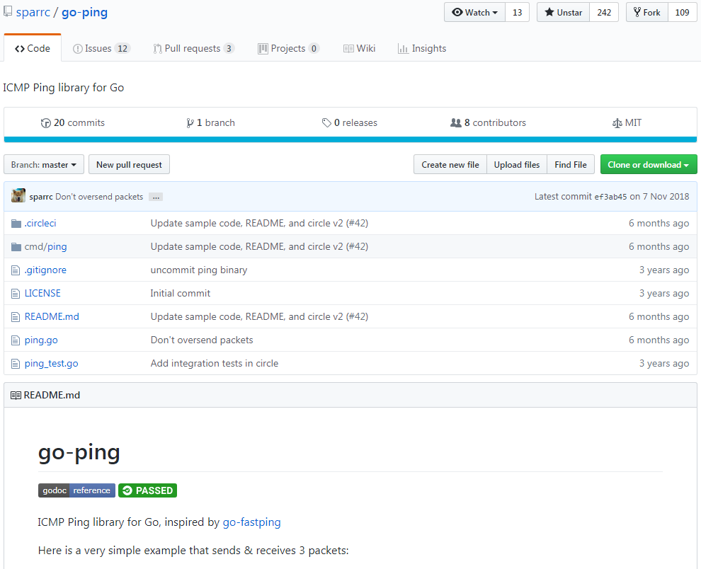
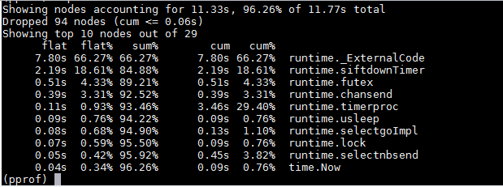
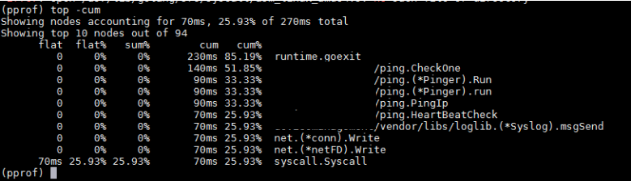

## 前言
前面我们研究了Ticker的实现原理，已经知道Ticker如果不主动停止会有资源泄露的问题。

本节介绍一个真实的案例，重点分析产生资源泄露的现象以及排查思路。

## 应用背景
曾经做过一个产品，不经意间出现了CPU使用率缓慢升高，最后CPU使用率竟然达到了100%，严重影响了业务。经过排查，问题出在Ticker的使用方式上，创建了Ticker，在使用结束后没有释放导致的。

该产品需要监控其他服务器的健康状态，其中很常见的一种做法是心跳检测。简单的说，周期性的ping这些服务器，能在指定时间内收到ack说明与该服务器之间的网络没问题。

当时使用了一个小众的开源组件`tatsushid/go-fastping`来做ping。
该组件介绍如下图所示：



## 问题现象
在做性能测试时，管理了1000台服务器，差不多4天后发现系统越来越慢，查看CPU使用情况，结果发现CPU使用率已经达到100%。

排查性能问题主要使用pprof，关于pprof的使用方法及原理介绍在请参照相关章节。

使用pprof查看CPU使用情况，主要是查看CPU都在忙什么：



从上图可以看出，CPU主要是被runtime包占用了，其中第二行`runtime.siftdownTimer`正是timerproc中的一个动作。

再使用pprof查看函数调用栈，主要看是哪些函数在使用CPU：



从上图可以看出，CPU主要是被ping模块占用，其中`ping.(*Pinger).Run`正是开源组件的一个接口。

经过pprof分析可以很清晰的指出问题出在go-fastping组件的Run()接口中，而且是与timer相关的。问题定位到这里，解决就很简单了。

此处，可以先总结一下Ticker资源泄露的现象：
- CPU使用率持续升高
- CPU使用率缓慢升高

## 源码分析
出问题的源码在ping.go的run()方法中。为叙述方便，对代码做了适当简化：
```go
func (p *Pinger) run() {
	timeout := time.NewTicker(p.Timeout)    // 创建Ticker timeout
	interval := time.NewTicker(p.Interval)  // 创建Ticker

	for {
		select {
		case <-p.done:       // 正常退出，未关闭Ticker
			wg.Wait()
			return
		case <-timeout.C:    // 超时退出，未关闭Ticker
			close(p.done)
			wg.Wait()
			return
		case <-interval.C:
			if p.Count > 0 && p.PacketsSent >= p.Count {
				continue
			}
			err = p.sendICMP(conn)
			if err != nil {
				fmt.Println("FATAL: ", err.Error())
			}
		case r := <-recv:
			err := p.processPacket(r)
			if err != nil {
				fmt.Println("FATAL: ", err.Error())
			}
		}
		if p.Count > 0 && p.PacketsRecv >= p.Count {  // 退出，未关闭Ticker
			close(p.done)
			wg.Wait()
			return
		}
	}
}
```
该段代码可以看出，这个函数是有出口的，但在出口处没有关闭Ticker，导致资源泄露。

这个问题已经被修复了，可以看到修复后的局部代码如下：
```go
	timeout := time.NewTicker(p.Timeout)
	defer timeout.Stop()  // 使用defer保证Ticker最后被关闭
	interval := time.NewTicker(p.Interval)
	defer interval.Stop() // 使用defer保证Ticker最后被关闭
```

## 总结
有一种情况使用Ticker不主动关闭也不会造成资源泄露，比如，函数创建Ticker后就不会退出，直到进程结束。这种情况下不会持续的创建Ticker，也就不会造成资源泄露。

但是，不管哪种情况，创建一个Ticker后，紧跟着使用defer语句关闭Ticker总是好的习惯。因为，有可能别人无意间拷贝了你的部分代码，而忽略了关闭Ticker的动作。

> 赠人玫瑰手留余香，如果觉得不错请给个赞~
> 
> 本篇文章已归档到GitHub项目，求星~ [点我即达](https://github.com/RainbowMango/GoExpertProgramming)